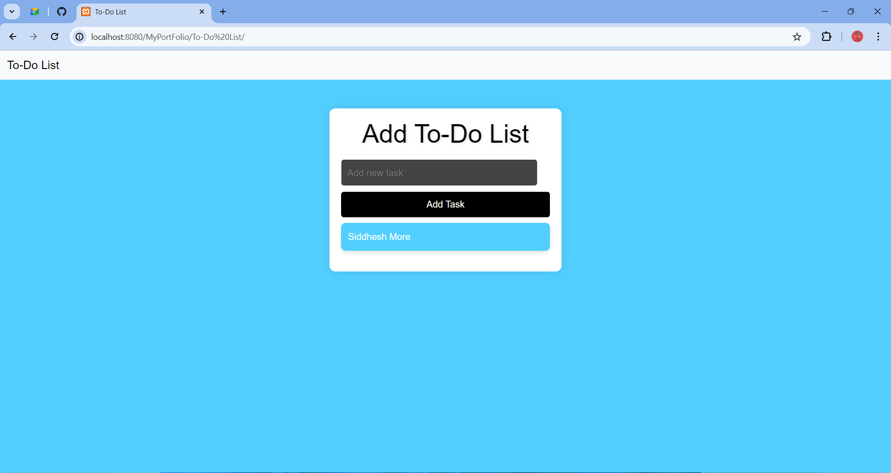

# To-Do List App

This is a simple To-Do List application built with HTML, CSS, and JavaScript. Users can add tasks to the list, mark them as completed, and delete them when they are finished.
<a href="https://siddesh0002t.github.io/To-Do-List"/>Run Code.</a>
## Features

- **Add tasks:** Users can enter a new task and click the "Add Task" button to add it to the list.
- **Mark tasks as completed:** Users can click on a task to mark it as completed. Completed tasks will be visually styled to indicate their status.
- **Delete tasks:** Users can click the "X" button next to a task to delete it from the list.
## Screenshots



## Technologies Used

- HTML
- CSS
- JavaScript

## Getting Started

1. **Clone the repository:**
   ```bash
   git clone https://github.com/Siddesh0002T/To-Do-List
